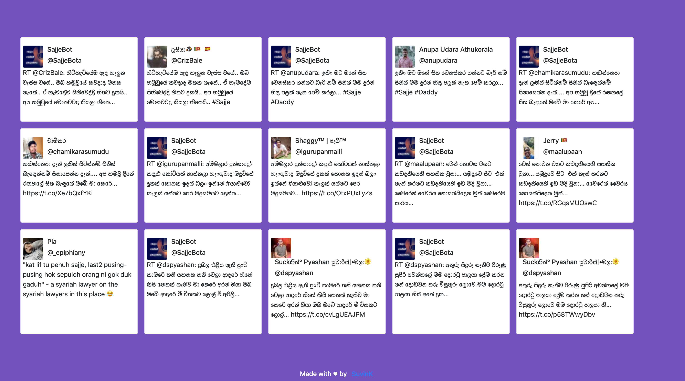

# TwitterWall

A simple Twitter wall which displays tweets of a certain #hashtag!
  

 

  

## Usage

Clone the repository into your preferred host. Open script.js file which is located in js folder.
Change the following line and put a keyword you prefer. 

    TweetJs.Search("YOUR_KEYWORD_HERE",

**Note:** 
index.php file is to host this site on Heroku as Heroku doesnt support direct HTML hosting. Remove index.php and rename hello.html to index.html to host the site directly.

## Disclaimer

This site uses TweetJS library and TweetJS only supports selected list of keywords. 

## Release History

* 1.0.0
    * Basic version whick fetches tweets from a given keyword. 

    
## Contributing

1. Fork it (<https://github.com/yourname/yourproject/fork>)

2. Create your feature branch (`git checkout -b feature/fooBar`)

3. Commit your changes (`git commit -am 'Add some fooBar'`)

4. Push to the branch (`git push origin feature/fooBar`)

5. Create a new Pull Request

  
